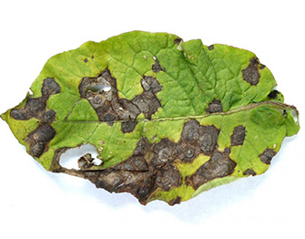

# SmartAgriculture: Smart Plant Monitoring and Disease Detection System

This project, named "Leaf", integrates functionalities for smart plant monitoring, automated irrigation, and precise leaf disease detection. It leverages machine learning models and sensor data to provide a comprehensive solution for plant care and health management.

## Features

*   **Automated Plant Monitoring & Irrigation:** This system continuously monitors environmental conditions and soil moisture using simulated sensor data (from `plant_data.json` updated by `plant_monitor.py`). It automates watering based on predefined thresholds, ensuring optimal plant hydration. The core logic for this automated irrigation, including sensor interaction and control mechanisms, is inspired by and can be further explored in its dedicated repository.
*   **Precise Leaf Disease Detection:** Utilizing an advanced, pre-trained MobileNetV2 model (specifically `linkanjarad/mobilenet_v2_1.0_224-plant-disease-identification` from Hugging Face), this feature accurately identifies various plant diseases from uploaded leaf images. It provides not just the disease name but also a confidence score, empowering farmers and plant enthusiasts with a powerful diagnostic tool. The extensive research and model training behind this can be found in its original project.
*   **Seed Size Prediction & Sowing Guidance:** This module is critical for optimal planting. It uses machine learning models loaded from `agricultural_models.pkl` to predict ideal seed size, sowing depth, and spacing based on various agricultural parameters like crop name, region, season, soil type, temperature, moisture, and soil pH. The `unique_values.pkl` file supplies the necessary dropdown options for these parameters. For a deep dive into the predictive models and their development, refer to the specific repository focused on seed analysis.
*   **Weather Integration:** The application includes a proxy API (`/api/weather-proxy`) that fetches current weather data (temperature, wind speed, weather code) from the Open-Meteo API based on geographical coordinates, providing valuable environmental context.
*   **User-Friendly Interface:** The entire system is accessible via a Flask-based web application. It features a modern, responsive UI built with HTML and CSS, designed for intuitive interaction and clear visualization of data and prediction results.

## Setup

To get started with the "Leaf" project, follow these steps:

1.  **Clone the repository:**

    ```bash
    git clone https://github.com/KrupalWarale/Leaf.git
    cd Leaf
    ```

2.  **Create a virtual environment (recommended):**

    ```bash
    python -m venv venv
    # On Windows:
    venv\Scripts\activate
    # On macOS/Linux:
    source venv/bin/activate
    ```

3.  **Install the required packages:**

    ```bash
    pip install -r requirements.txt
    ```

## Running the Application

1.  **Start the Flask server:**

    ```bash
    python app.py
    ```

2.  Open your web browser and navigate to:

    ```
    http://localhost:5000
    ```

## Usage

*   **Disease Detection:** Navigate to the "Leaf Disease" section, upload an image of a plant leaf, and receive immediate predictions on potential diseases and their confidence levels. Sample images for testing can be found in the `static/uploads` directory. [click here](https://github.com/KrupalWarale/SmartAgriculture-Smart-Plant-Monitoring-and-Disease-Detection-System/tree/main/static/uploads)

    Here's an example of a diseased leaf image:
    

*   **Seed Sizing & Sowing Guidance:** Go to the "Seed Size Analysis" page. Input crop details, environmental conditions, and soil parameters to get predictions for optimal seed size, sowing depth, and spacing, along with recommended crops for the given conditions.
*   **Sensor Data Monitoring:** Access the "Sensor Docs" page to view the current simulated sensor data, including temperature, humidity, soil moisture, motion detection, and pump status. The `plant_monitor.py` script can be run to update this data.
*   **Weather Information:** The application leverages a weather API to provide relevant environmental data for informed decisions.

## Technical Details

*   **Backend:** Developed with Flask, a lightweight Python web framework, handling routing, data processing, and serving machine learning predictions.
*   **Machine Learning Models:**
    *   **Leaf Disease:** Utilizes a pre-trained MobileNetV2 model for image classification, integrated through the Hugging Face Transformers library.
    *   **Agricultural Predictions:** `agricultural_models.pkl` contains trained models (e.g., RandomForest, Gradient Boosting) for seed size, sowing depth, and spacing prediction. `unique_values.pkl` stores label encoders and unique categorical values for model inputs.
*   **Frontend:** Built using standard web technologies: HTML for structure, CSS for styling, and JavaScript for dynamic interactions and API calls.
*   **Data Handling:** `.pkl` files are used for persistent storage of machine learning models and categorical data. Sensor data is managed in `plant_data.json` within the `seedSize/sensorData` directory.
*   **External APIs:** Integrates with the Open-Meteo API for fetching real-time weather information.

## Project Structure

```
leaf/
├── agricultural_models.pkl
├── app.py
├── Procfile
├── requirements.txt
├── seedSize/
│   ├── sensorData/
│   │   ├── plant_data.json
│   │   └── plant_monitor.py
├── static/
│   ├── css/
│   ├── images/
│   │   └── soil_types/
│   │       ├── img/
│   │       └── soil_styles.css
│   │       └── soil_types.js
│   ├── js/
│   │   └── weatherService.js
│   ├── soil_types.json
│   ├── styles.css
│   ├── taro-leaves-leaf-1296x728-header.webp
│   └── uploads/
├── templates/
│   ├── homepage.html
│   ├── leaf_disease_index.html
│   ├── seed_size_index.html
│   ├── sensor_docs.html
│   └── taro-leaves-leaf-1296x728-header.webp
└── unique_values.pkl
```

## Further Understanding: A Guided Tour Through Related Projects

To fully grasp the depth and individual working mechanisms of the key components integrated into "Leaf", you can explore their dedicated foundational repositories. Each project focuses on a specific aspect, providing detailed insights into its development, methodologies, and underlying code:

*   **For an in-depth look at the automated plant monitoring and irrigation system, including sensor integration and water pump control logic, you can visit:**
    *   [Automated-remote-Plant-irrigation-system](https://github.com/KrupalWarale/Automated-remote-Plant-irrigation-system)

*   **To understand the intricacies of the MobileNetV2 model, its training process with the PlantVillage dataset, and the complete pipeline for precise leaf disease identification, please refer to:**
    *   [Leaf-Disease-detection-precise-prediction](https://github.com/KrupalWarale/Leaf-Disease-detection-precise-prediction)

*   **If you're interested in the machine learning models and methodologies behind predicting optimal seed size, sowing depth, and sowing spacing, the following repository provides comprehensive details:**
    *   [seed-size-prediction-seedSize-sowingDepth-sowingSpacing](https://github.com/KrupalWarale/seed-size-prediction-seedSize-sowingDepth-sowingSpacing)

By exploring these individual projects, you can gain a more profound understanding of the robust and intelligent systems that power "SmartAgriculture". 

Arduino code had been placed in root folder to configure fetching of sensor data mention in documenation of fetch sensors data . 
